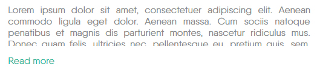

#Collapser - decorate your text is easy!
-------------

### Description

	allows to collapse text blocks

### Agruments

- minHeight
- maxHeight
- timeFunc - timing function for animation of toogles
- buttonAppend - where to append the button
- speed
- textOpened
- textClosed
- opened - text block be opened when page be loaded
- buttonClass - class for button

-------------

	it have two way for initialize:
	1) create div element with class "linebar" and define attributes wich must begin from "data-collapse-" + option
	2) use javascript notation as you can see below

### Examples

```html
	<div
		class="collapser"
		data-collapse-button-class="morebut"
		data-collapse-open-text="Скрыть"
		data-collapse-close-text="Читать далее"
		data-collapse-min-height="70"
	>
	Your text...
	</div>
```

```js
	$('.someclass').collapse({
		minHeight : 70,
		maxHeight : 100,
		timeFunc : "linear",
		buttonAppend : "#here",
		speed : 250,
		textOpened : "opened",
		textClosed : "closed",
		collapsed : true,
		buttonClass : "theclass"
	});
```

### Result



-------------
Thank's for using.
Developed by Ustinov Maxim - [ewclide](http://vk.com/ewclide)